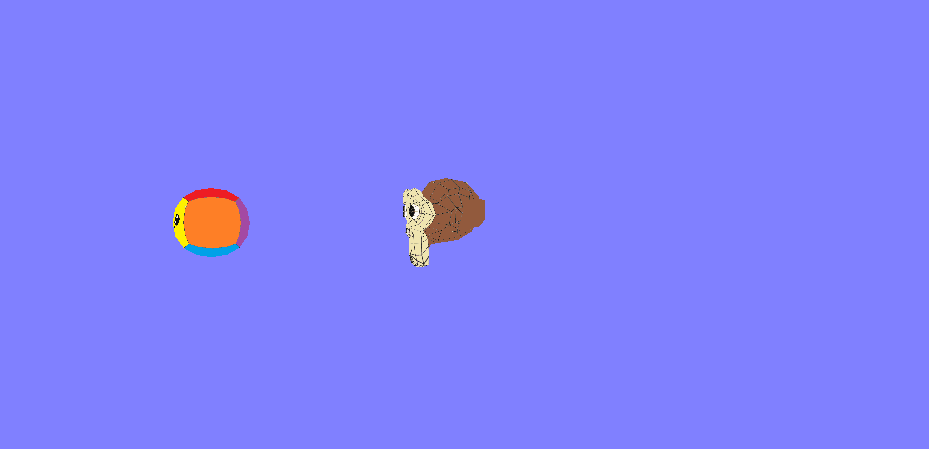

# Módulo Final

## Instruções de Execução

- Configure o Visual Studio para executar em x86

- Abra o arquivo .sln

- Aperte o botão play na IDE

## Resultado

Abaixo está um gif do projeto final sendo executado. A câmera é controlada pelo mouse e pode se afastar ou se aproximar, além de se mover para direita e esquerda com comandos do teclado. 

Nessa pasta também se encontra a apresentação de slides em pdf mostrada para obtenção da nota do Grau B da disciplina.

